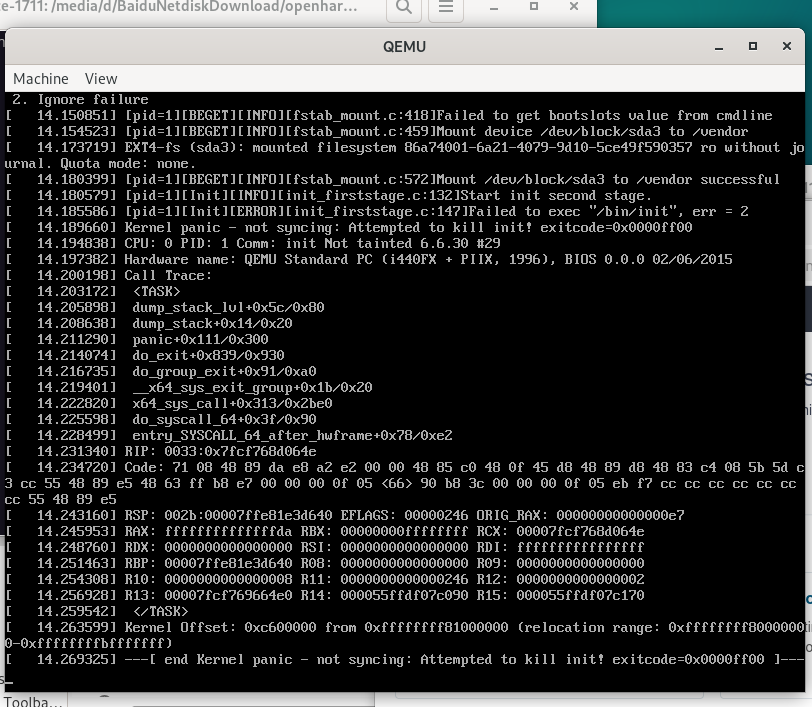

# openharmony

### doesn't work ...

https://gitee.com/ohos-porting-communities

https://www.bilibili.com/video/BV13E4m1R7ow/

https://pan.baidu.com/s/1elbjEx4Koqtfasp6A9c48A?pwd=ohos

https://repo.huaweicloud.com/harmonyos/os/5.1.0-Release/

This one works in qemu:

https://m.ddooo.com/softdown/223454.htm

